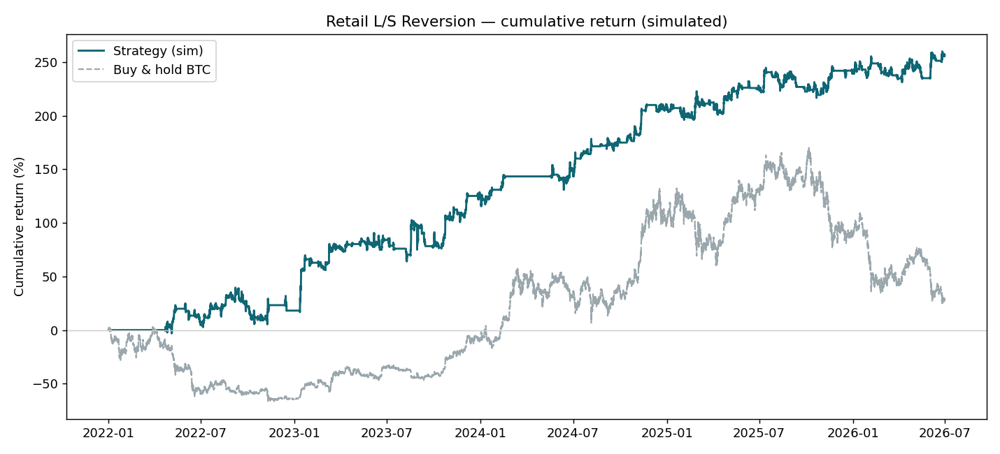
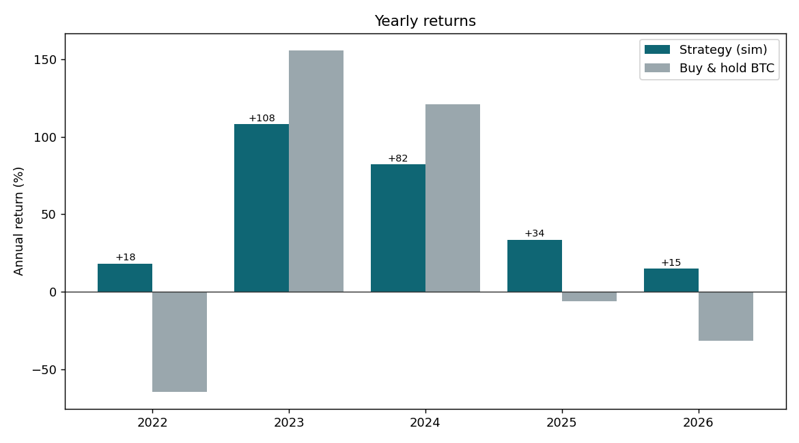
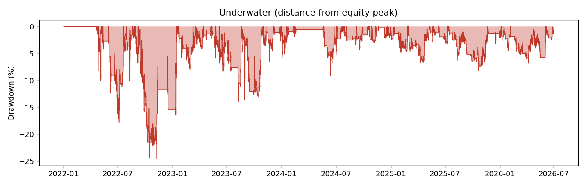

# Retail Long/Short-Ratio Reversion — BTC perpetual

A contrarian strategy on Binance BTCUSDT perpetual futures: **fade the crowd.**
When Binance's *global long/short account ratio* is extreme relative to its own
recent history, take the opposite side and hold for 3 days.

> ⚠️ **This is a research / paper-trading project.** All performance figures below
> are a **historical backtest (simulation)**, not real trading results. The live
> bot runs on the Binance **testnet (paper money)** only. Crypto leverage can lose
> more than your capital. Nothing here is investment advice.

---

## The rules

1. Take the **global long/short account ratio** (`globalLongShortAccountRatio`),
   updated hourly, public.
2. Rank the current value within its **trailing 90-day** distribution.
   - **≥ 90th percentile** (retail crowded *long*) → **SHORT**.
   - **≤ 10th percentile** (retail crowded *short*) → **LONG**.
3. **Hold 3 days**, then close — win or lose. **No stop-loss** (by design: this is
   a slow-reversion signal; a tight stop washes you out *before* the reversion,
   turning a winner into a loser).
4. **Size inversely to volatility** — bigger in calm markets, smaller in turbulent
   ones — clipped to a sane band.

Only one position at a time, at most one action per hourly candle.

---

## Backtest results (this repo's own run)

Independently reconstructed from the strategy spec and run on **real** Binance
data (2022-01-01 → 2026-06-30, 4.49 years, 41,616 hourly candles):

| Metric | Result |
|---|---|
| **Cumulative return** | **+256.7%** (buy & hold BTC: +28.2%) |
| CAGR | +32.7% |
| **Sharpe (daily)** | **1.31** |
| **Max drawdown** | **−24.5%** |
| Trades | 259 (long 130 / short 129) |
| Win rate | 52.5% |
| Avg win / loss | +45.9 / −28.3 (per 1,000 nominal) |
| Profit factor | 1.79 |
| Daily correlation w/ BTC | −0.08 (≈ market-neutral over time) |

Yearly (strategy vs buy & hold): 2022 **+18%** / −65% · 2023 **+108%** / +156% ·
2024 **+82%** / +121% · 2025 **+34%** / −6% · 2026 (H1) **+15%** / −32%.
The strategy is positive every year, including the two bear years, because it
also shorts.





Full per-trade log: [`results/trades.csv`](results/trades.csv) · metrics:
[`results/metrics.json`](results/metrics.json).

These numbers land close to the source research spec (+264%, Sharpe 1.63, MaxDD
−27%, 262 trades, 55% win-rate) despite an independent reconstruction — small
differences come from exact sizing/cost assumptions and execution timing.

---

## Data

Everything is public and no-auth, pulled from **[Binance Vision](https://data.binance.vision)**:

- **Price**: 1h USDⓈ-M perpetual klines (monthly dumps).
- **Signal**: futures `metrics` daily dumps, column `count_long_short_ratio`
  (= the `globalLongShortAccountRatio` the live API exposes), resampled to hourly.

The public REST API only returns ~30 days of the ratio, so historical backtesting
*requires* the Vision dumps (which go back to 2021). The live bot maintains its
own rolling 90-day store, topping up from the API each hour.

```bash
python -m src.data.download --symbol BTCUSDT --start 2021-10-01 --end 2026-06-30
```

(`2021-10-01` includes the 90-day warm-up before the 2022-01-01 trading start.)

---

## Setup

```bash
python3 -m venv .venv && source .venv/bin/activate
pip install -r requirements.txt
```

## Run the backtest

```bash
python scripts/run_backtest.py     # writes results/ (trades.csv, charts, metrics.json)
```

## Web dashboard

An interactive dashboard (KPIs, equity/drawdown/yearly charts, a sortable &
filterable 259-trade table, and the latest signal) lives in [`docs/`](docs/).

```bash
python scripts/build_dashboard.py  # regenerates docs/data.js from the backtest
open docs/index.html               # view locally (works standalone, no server)
```

To publish it as a website, make the repo public (or use GitHub Pro for private
Pages), then enable **Settings → Pages → Source: `main` / `/docs`**. The URL will
be `https://durant0509.github.io/crypto_test/`. The dashboard's "latest signal"
reflects the backtest dataset's last candle; the live bot polls the real-time
ratio.

## Run the live bot (testnet)

```bash
cp config.example.yaml config.yaml   # then fill in your TESTNET keys; config.yaml is gitignored
python -m src.live.bot --once        # evaluate the latest candle (cron-friendly)
```

Hourly via cron:

```cron
5 * * * * cd /path/to/crypto_test && .venv/bin/python -m src.live.bot --once >> data/cron.log 2>&1
```

`dry_run: true` in the config computes and logs the decision without sending any
order. It even runs **without API keys** (signal-only), logging the would-be trade.

### Risk controls

| Control | How |
|---|---|
| **Emergency flatten** | `python -m src.live.bot --flatten` — closes everything and writes a `HALT` file; the bot won't open new positions until you delete it. |
| **Notional hard cap** | `max_notional` in config — position size is always clipped to it. |
| **Idempotency** | the acted-on candle timestamp is persisted; the same candle can never fire a second order. |
| **Exchange reconcile** | live position is read back from the exchange, not trusted from local state. |
| **Dry-run default** | `dry_run: true` out of the box. |

---

## Layout

```
src/
  data/download.py       # Binance Vision downloader -> data/hourly.parquet
  strategy/signal.py     # signal + inverse-vol sizing (shared by backtest & bot)
  backtest/engine.py     # event-driven, no look-ahead, mark-to-market equity
  backtest/metrics.py    # Sharpe, drawdown, win rate, yearly, buy&hold, corr
  live/binance_client.py # minimal USDⓈ-M futures client (testnet orders)
  live/history.py        # rolling 90d ratio store for the live bot
  live/bot.py            # the trader: signal -> reconcile -> order, with risk controls
scripts/run_backtest.py
results/                 # committed backtest artifacts
config.example.yaml
```

## What this hasn't proven

- The signal is **public** — if enough people trade it, the edge erodes.
- All tests are on data that **already happened**; the only real out-of-sample is
  the future. That's what the testnet phase accumulates.
- Drawdown could exceed the historical −25%. One exchange's positioning ≠ the
  whole market. Real slippage may be worse than assumed.
